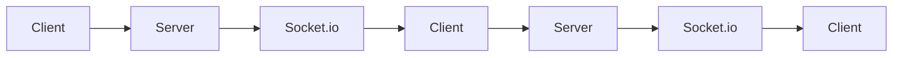
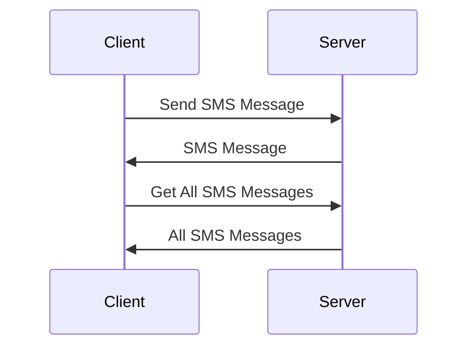
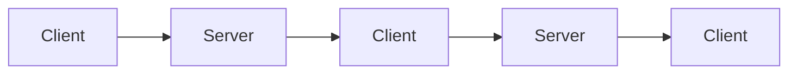
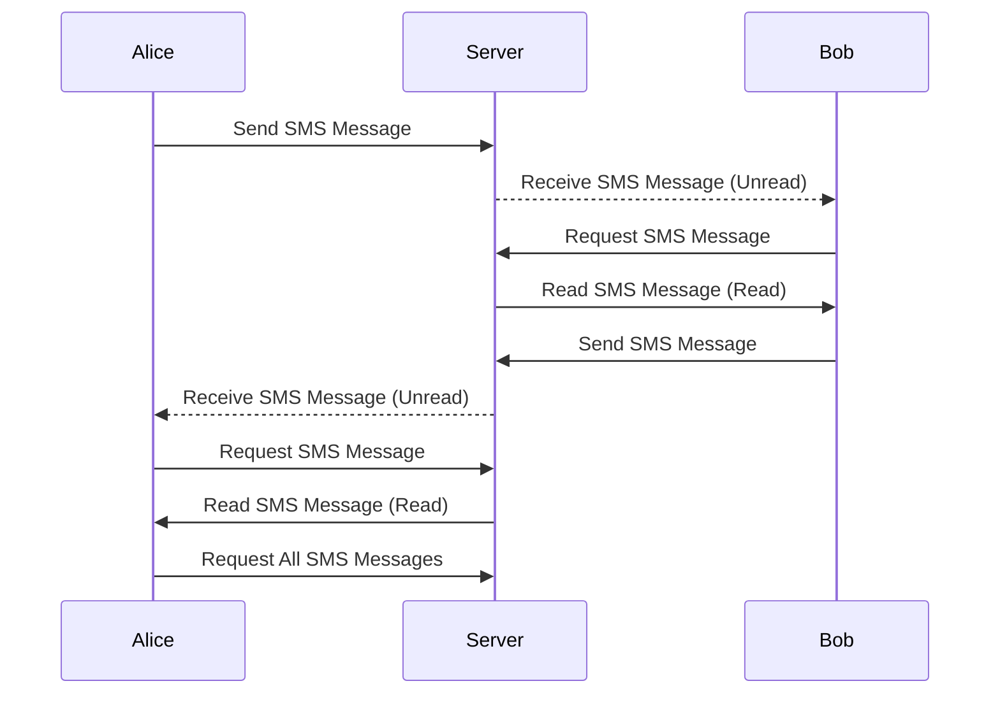

# PHP SMS Messages Queueing 

```
#Question

Brief:

Write a simple PHP Application that offers queueing of SMS Messages.

 

Requirements:

Application must be written in PHP (8.x preferably)
HTTP API to insert an SMS Message in the queue
HTTP API to consume an SMS Message from the queue and returns it in JSON format (FIFO)
HTTP API to get the total number of messages in the queue 
HTTP API to get all SMS messages in the queue in JSON format
Have everything running without any dependency on an external system (database, service, etc.)
Simple readme on how to use the application
 

Bonus but Not Compulsory:

Use of composer packages where convenient instead of building from scratch
Secure coding with correct amount of filters applied
Have the project working inside a Docker container (that builds and runs locally)
Use vanilla PHP (no framework)
Submit the exercise via a github link
 

What we are looking for:

Adherence to standard coding style (PSR-12)
Adherence to modern coding standards (OOP, SOLID, DRY)
Code that can be easily understood with just right amount of clear and concise comments
Use of proper API methods for each endpoint (GET, POST, etc)

```

## There are 2 Applications in this repository

|         | Description | Run on Local | Run on Docker |
|---------|-------------|--------------|---------------|
| Full-Stack Socket.io | This is a full-stack application that uses Socket.io to send SMS messages to the client. |```php start.php start```|``` -- not available --```|
| API | This is a simple API application that uses a queue to send SMS messages to the client. |```php -S 0.0.0.0:8000 server.php```|```docker compose up -d```|


## Installation & Run on Local (Full-Stack Socket.io)

1. Clone the repository

```bash
git clone https://github.com/nrazam95/PHP-SMS-Messaging-Queue.git
```

2. Install dependencies

```bash
composer install
```

3. Run the application

```bash
php start.php start
```


## Installation & Run on Local (API)

1. Clone the repository

```bash
git clone https://github.com/nrazam95/PHP-SMS-Messaging-Queue.git
```

2. Install dependencies

```bash
composer install
```

3. Run the application

```bash
php -S localhost:8000 server.php
```

## Installation & Run on Docker (API)

1. Clone the repository

```bash
git clone https://github.com/nrazam95/PHP-SMS-Messaging-Queue.git
```

2. Run the application

```bash
docker compose up -d
```

## Prepare Your Environment

1. Create a .env file in the root directory of the project

```bash
cp .env.example .env
```


## Usage

1. Open your browser and go to http://{YOUR_HOST}:{YOUR_PORT}/


## Architecture

### Full-Stack Socket.io

1. The client connects to the server using Socket.io
2. The client sends a request to the server to send an SMS message
3. The server sends the SMS message to the client using Socket.io
4. The client receives the SMS message from the server using Socket.io
5. The client sends a request to the server to get all SMS messages
6. The server sends all SMS messages to the client using Socket.io
7. The client receives all SMS messages from the server using Socket.io





### API

1. The client sends a request to the server to send an SMS message
2. The server sends the SMS message to the client
3. The client sends a request to the server to get all SMS messages
4. The server sends all SMS messages to the client





# PHP SMS Messages Queueing Documentation

| Category | Name | Description | Method | Endpoint | Security |
|----------|------|-------------|--------|----------|----------|
| Authentication | Register | Register a new user | POST | /signup | No JWT |
| Authentication | Login | Login a user | POST | /login | No JWT |
| Authentication | Logout | Logout a user | POST | /logout | JWT |
| User | Delete User | Delete the authenticated user | DELETE | /users | JWT |
| User | Get All Users | Get all users | GET | /users| JWT |
| User | Get User By ID | Get a user by ID | GET | /users/{id} | JWT |
| User | Update User By ID | Update a user by ID | PUT | /users/{id} | JWT |
| User | Delete User By ID | Delete a user by ID | DELETE | /users/{id} | JWT |
| Room | Create Room | Create a new room | POST | /rooms | JWT |
| Room | Get All Rooms | Get all rooms | GET | /rooms | JWT |
| Room | Get Room By ID | Get a room by ID | GET | /rooms/{id} | JWT |
| Room | Update Room By ID | Update a room by ID | PUT | /rooms/{id} | JWT |
| Room | Delete Room By ID | Delete a room by ID | DELETE | /rooms/{id} | JWT |
| SMS | Send SMS Message | Send an SMS message | POST | /rooms/{id}/ | JWT |
| SMS | Get All SMS Messages | Get all SMS messages | GET | /rooms/{id}/ | JWT |
| SMS | Get SMS Message By ID | Get an SMS message by ID | GET | /rooms/{id}/sms/{sms_id} | JWT |
| SMS | Update SMS Message By ID | Update an SMS message by ID | PUT | /rooms/{id}/sms/{sms_id} | JWT |
| SMS | Delete SMS Message By ID | Delete an SMS message by ID | DELETE | /rooms/{id}/sms/{sms_id} | JWT |
| MySelf | Get Myself | Get the authenticated user | GET | /me | JWT |
| MySelf | All Unread SMS Messages | Get all unread SMS messages | GET | /me/unread-sms | JWT |

**Notice:** *The endpoints that require JWT authentication, you need to pass the JWT token in the header of the request.*

**What is JWT Token?** *JWT is a standard for creating access tokens for an application. The token is signed by the server using a secret key and contains information about the user. The token is sent to the client and the client sends it back to the server in the Authorization header.*

**Example:** *Authorization: Bearer {JWT_TOKEN}*

## Authentication

<table>
    <tr>
        <td valign="top" width="50%">
            <h1>Register</h1>
            <p>Register a new user</p>
            <h4>Endpoint</h4>
            <p><code>/signup</code></p>
            <h4>Method</h4>
            <p><code>POST</code></p>
            <h4>Request Header</h4>
            <table>
                <tr>
                    <th>Header Type</th>
                    <th>Type</th>
                    <th>Required</th>
                    <th>Description</th>
                </tr>
                <tr>
                    <td>Content-Type</td>
                    <td>string</td>
                    <td>yes</td>
                    <td>application/json</td>
                </tr>
            </table>
            <h4>Parameters</h4>
            <p>No Parameters Required</p>
            <h4>Body</h4>
            <table>
                <tr>
                    <th>Body Type</th>
                    <th>Type</th>
                    <th>Required</th>
                    <th>Description</th>
                </tr>
                <tr>
                    <td>name</td>
                    <td>string</td>
                    <td>yes</td>
                    <td>The name of the user</td>
                </tr>
                <tr>
                    <td>email</td>
                    <td>string</td>
                    <td>yes</td>
                    <td>The email of the user</td>
                </tr>
                <tr>
                    <td>phone</td>
                    <td>string</td>
                    <td>yes</td>
                    <td>The phone number of the user</td>
                </tr>
                <tr>
                    <td>password</td>
                    <td>string</td>
                    <td>yes</td>
                    <td>The password of the user</td>
                </tr>
            </table>
            <h4>Example Request</h4>
            <pre><code class="language-javascript">
                    {
                        "name": "Vochelle",
                        "email": "vochelle@gmail.com",
                        "password": "1234",
                        "phone": "+601987654321"
                    }
            </code></pre>
            <h4>Example Response</h4>
            <pre><code class="language-javascript">
                    {
                        "status": "success",
                        "data": {
                            "token": "QMSEWFhDGrDVqqHMgxrULAvZgEfxsqcO5BrRF1in/d0="
                        }
                    }
            </code></pre>
            <h4>Error Response</h4>
            <pre><code class="language-javascript">
                    {
                        "status": "error",
                        "data": {
                            "message": "User Exists"
                        }
                    }
            </code></pre>
        </td>
        <td valign="top" width="50%">
            <h1>Login</h1>
            <p>Login a user</p>
            <h4>Endpoint</h4>
            <p><code>/login</code></p>
            <h4>Method</h4>
            <p><code>POST</code></p>
            <h4>Request Header</h4>
            <table>
                <tr>
                    <th>Header Type</th>
                    <th>Type</th>
                    <th>Required</th>
                    <th>Description</th>
                </tr>
                <tr>
                    <td>Content-Type</td>
                    <td>string</td>
                    <td>yes</td>
                    <td>application/json</td>
                </tr>
            </table>
            <h4>Parameters</h4>
            <p>No Parameters Required</p>
            <h4>Body</h4>
            <table>
                <tr>
                    <th>Body Type</th>
                    <th>Type</th>
                    <th>Required</th>
                    <th>Description</th>
                </tr>
                <tr>
                    <td>email</td>
                    <td>string</td>
                    <td>yes</td>
                    <td>The email of the user</td>
                </tr>
                <tr>
                    <td>password</td>
                    <td>string</td>
                    <td>yes</td>
                    <td>The password of the user</td>
                </tr>
            </table>
            <h4>Notes</h4>
            <p>On success, the response will contain a JWT token that will be used for authentication.</p>
            <p>On failure, the response will contain an error message.</p>
            <h4>Example Request</h4>
            <pre><code class="language-javascript">
                    {
                        "email": "vochelle@gmail.com",
                        "password": "1234"
                    }
            </code></pre>
            <h4>Example Response</h4>
            <pre><code class="language-javascript">
                    {
                        "status": "success",
                        "data": {
                            "token": "QMSEWFhDGrDVqqHMgxrULAvZgEfxsqcO5BrRF1in/d0="
                        }
                    }
            </code></pre>
            <h4>Error Response</h4>
            <pre><code class="language-javascript">
                    {
                        "status": "error",
                        "data": {
                            "message": "Invalid Credentials"
                        }
                    }
            </code></pre>
        </td>
        <td valign="top" width="50%">
            <h1>Logout</h1>
            <p>Logout a user</p>
            <h4>Endpoint</h4>
            <p><code>/logout</code></p>
            <h4>Method</h4>
            <p><code>POST</code></p>
            <h4>Parameters</h4>
            <p>No parameters are required.</p>
            <h4>Request Header</h4>
            <table>
                <tr>
                    <th>Header Type</th>
                    <th>Type</th>
                    <th>Required</th>
                    <th>Description</th>
                </tr>
                <tr>
                    <td>Content-Type</td>
                    <td>string</td>
                    <td>yes</td>
                    <td>application/json</td>
                </tr>
                <tr>
                    <td>Authorization</td>
                    <td>string</td>
                    <td>yes</td>
                    <td>Bearer {token}</td>
                </tr>
            </table>
            <h4>Notes</h4>
            <p>No parameters are required.</p>
            <h4>Example Request</h4>
            <pre><code class="language-javascript">
                    {}
            </code></pre>
            <h4>Example Response</h4>
            <pre><code class="language-javascript">
                    {
                        "status": "success",
                        "data": "Logged out successfully"
                    }
            </code></pre>
        </td>
    </tr>
</table>

## User

<table>
    <tr>
        <td valign="top" width="50%">
            <h1>Create User</h1>
            <p>Create a new user</p>
            <h4>Endpoint</h4>
            <p><code>/users</code></p>
            <h4>Method</h4>
            <p><code>POST</code></p>
            <h4>Request Header</h4>
            <table>
                <tr>
                    <th>Header Type</th>
                    <th>Type</th>
                    <th>Required</th>
                    <th>Description</th>
                </tr>
                <tr>
                    <td>Content-Type</td>
                    <td>string</td>
                    <td>yes</td>
                    <td>application/json</td>
                </tr>
                <tr>
                    <td>Authorization</td>
                    <td>string</td>
                    <td>yes</td>
                    <td>Bearer {token}</td>
                </tr>
            </table>
            <h4>Parameters</h4>
            <p>No Parameters Required</p>
            <h4>Body</h4>
            <table>
                <tr>
                    <th>Parameter</th>
                    <th>Type</th>
                    <th>Required</th>
                    <th>Description</th>
                </tr>
                <tr>
                    <td>name</td>
                    <td>string</td>
                    <td>yes</td>
                    <td>The name of the user</td>
                </tr>
                <tr>
                    <td>email</td>
                    <td>string</td>
                    <td>yes</td>
                    <td>The email of the user</td>
                </tr>
                <tr>
                    <td>phone</td>
                    <td>string</td>
                    <td>yes</td>
                    <td>The phone number of the user</td>
                </tr>
                <tr>
                    <td>password</td>
                    <td>string</td>
                    <td>yes</td>
                    <td>The password of the user</td>
                </tr>
            </table>
            <h4>Example Request</h4>
            <pre><code class="language-javascript">
                    {
                        "name": "Glade",
                        "email": "glade@gmail.com",
                        "password": "1234",
                        "phone": "+60123456789"
                    }
            </code></pre>
            <h4>Example Response</h4>
            <pre><code class="language-javascript">
                    {
                        "status": "success",
                        "data": {
                            "id": 2,
                            "name": "Glade",
                            "email": "glade@gmail.com",
                            "password": "1234",
                            "created_at": "2023-01-13 05:12:22"
                        }
                    }
            </code></pre>
            <h4>Authorization Error Response</h4>
            <pre><code class="language-javascript">
                    {
                        "status": "error",
                        "data": {
                            "message": "Unauthorized"
                        }
                    }
            </code></pre>
            <h4>Error Response</h4>
            <pre><code class="language-javascript">
                    {
                        "status": "error",
                        "data": {
                            "message": "User Exists"
                        }
                    }
            </code></pre>
        </td>
        <td valign="top" width="50%">
            <h1>Get User</h1>
            <p>Get a user</p>
            <h4>Endpoint</h4>
            <p><code>/users/{id}</code></p>
            <h4>Method</h4>
            <p><code>GET</code></p>
            <h4>Request Header</h4>
            <table>
                <tr>
                    <th>Header Type</th>
                    <th>Type</th>
                    <th>Required</th>
                    <th>Description</th>
                </tr>
                <tr>
                    <td>Content-Type</td>
                    <td>string</td>
                    <td>yes</td>
                    <td>application/json</td>
                </tr>
                <tr>
                    <td>Authorization</td>
                    <td>string</td>
                    <td>yes</td>
                    <td>Bearer {token}</td>
                </tr>
            </table>
            <h4>Parameters</h4>
            <table>
                <tr>
                    <th>Parameter</th>
                    <th>Type</th>
                    <th>Required</th>
                    <th>Description</th>
                </tr>
                <tr>
                    <td>id</td>
                    <td>integer</td>
                    <td>yes</td>
                    <td>The id of the user</td>
                </tr>
            </table>
            <h4>Body</h4>
            <p>No Body Required</p>
            <h4>Example Request</h4>
            <pre><code class="language-javascript">
                    {}
            </code></pre>
            <h4>Example Response</h4>
            <pre><code class="language-javascript">
                    {
                        "status": "success",
                        "data": {
                            "id": 1,
                            "name": "Vochelle",
                            "email": "vochelle@gmail.com",
                            "password": "1234",
                            "phone": "+601987654321",
                            "created_at": 1673585917
                        }
                    }
            </code></pre>
        </td>
        <td valign="top" width="50%">
            <h1>Get Users</h1>
            <p>Get all users</p>
            <h4>Endpoint</h4>
            <p><code>/users</code></p>
            <h4>Method</h4>
            <p><code>GET</code></p>
            <h4>Request Header</h4>
            <table>
                <tr>
                    <th>Header Type</th>
                    <th>Type</th>
                    <th>Required</th>
                    <th>Description</th>
                </tr>
                <tr>
                    <td>Content-Type</td>
                    <td>string</td>
                    <td>yes</td>
                    <td>application/json</td>
                </tr>
                <tr>
                    <td>Authorization</td>
                    <td>string</td>
                    <td>yes</td>
                    <td>Bearer {token}</td>
                </tr>
            </table>
            <h4>Parameters</h4>
            <p>No Parameters Required</p>
            <h4>Body</h4>
            <p>No Body Required</p>
            <h4>Example Request</h4>
            <pre><code class="language-javascript">
                    {}
            </code></pre>
            <h4>Example Response</h4>
            <pre><code class="language-javascript">
                    {
                        "status": "success",
                        "data": [
                            {
                                "id": 1,
                                "name": "Vochelle",
                                "email": "vochelle@gmail.com",
                                "password": "1234",
                                "phone": "+601987654321",
                                "created_at": 1673585917
                            },
                            {
                                "id": 2,
                                "name": "Glade",
                                "email": "glade@gmail.com",
                                "password": "1234",
                                "phone": "+60123456789",
                                "created_at": 1673586742
                            }
                        ]
                    }
            </code></pre>
        </td>
        <td valign="top" width="50%">
            <h1>Update User</h1>
            <p>Update a user</p>
            <h4>Endpoint</h4>
            <p><code>/users/{id}</code></p>
            <h4>Method</h4>
            <p><code>PUT</code></p>
            <h4>Request Header</h4>
            <table>
                <tr>
                    <th>Header Type</th>
                    <th>Type</th>
                    <th>Required</th>
                    <th>Description</th>
                </tr>
                <tr>
                    <td>Content-Type</td>
                    <td>string</td>
                    <td>yes</td>
                    <td>application/json</td>
                </tr>
                <tr>
                    <td>Authorization</td>
                    <td>string</td>
                    <td>yes</td>
                    <td>Bearer {token}</td>
                </tr>
            </table>
            <h4>Parameters</h4>
            <table>
                <tr>
                    <th>Parameter</th>
                    <th>Type</th>
                    <th>Required</th>
                    <th>Description</th>
                </tr>
                <tr>
                    <td>id</td>
                    <td>integer</td>
                    <td>yes</td>
                    <td>The id of the user</td>
                </tr>
            </table>
            <h4>Body Type</h4>
            <table>
                <tr>
                    <th>Parameter</th>
                    <th>Type</th>
                    <th>Required</th>
                    <th>Description</th>
                </tr>
                <tr>
                    <td>name</td>
                    <td>string</td>
                    <td>yes</td>
                    <td>The name of the user</td>
                </tr>
                <tr>
                    <td>email</td>
                    <td>string</td>
                    <td>yes</td>
                    <td>The email of the user</td>
                </tr>
                <tr>
                    <td>phone</td>
                    <td>string</td>
                    <td>yes</td>
                    <td>The phone number of the user</td>
                </tr>
            </table>
            <h4>Example Request</h4>
            <pre><code class="language-javascript">
                    {
                        "name": "John Doe",
                        "email": "xxx",
                        "phone": "0123456789",
                    }
            </code></pre>
            <h4>Example Response</h4>
            <pre><code class="language-javascript">
                    {
                        "status": "success",
                        "data": null
                    }
            </code></pre>
            <h4>Example Error Response</h4>
            <pre><code class="language-javascript">
                    {
                        "status": "error",
                        "data": {
                            "message": "Unauthorized"
                        }
                    }
            </code></pre>
        </td>
        <td valign="top" width="50%">
            <h1>Delete User</h1>
            <p>Delete a user</p>
            <h4>Endpoint</h4>
            <p><code>/users/{id}</code></p>
            <h4>Method</h4>
            <p><code>DELETE</code></p>
            <h4>Request Header</h4>
            <table>
                <tr>
                    <th>Header Type</th>
                    <th>Type</th>
                    <th>Required</th>
                    <th>Description</th>
                </tr>
                <tr>
                    <td>Content-Type</td>
                    <td>string</td>
                    <td>yes</td>
                    <td>application/json</td>
                </tr>
                <tr>
                    <td>Authorization</td>
                    <td>string</td>
                    <td>yes</td>
                    <td>Bearer {token}</td>
                </tr>
            </table>
            <h4>Parameters</h4>
            <table>
                <tr>
                    <th>Parameter</th>
                    <th>Type</th>
                    <th>Required</th>
                    <th>Description</th>
                </tr>
                <tr>
                    <td>id</td>
                    <td>integer</td>
                    <td>yes</td>
                    <td>The id of the user</td>
                </tr>
            </table>
            <h4>Body Type</h4>
            <p>No body required</p>
            <h4>Example Request</h4>
            <pre><code class="language-javascript">
                    {}
            </code></pre>
            <h4>Example Response</h4>
            <pre><code class="language-javascript">
                    {
                        "status": "success",
                        "data": null
                    }
            </code></pre>
            <h4>Example Error Response</h4>
            <pre><code class="language-javascript">
                    {
                        "status": "error",
                        "data": {
                            "message": "Unauthorized"
                        }
                    }
            </code></pre>
        </td>
    </tr>
</table>

## Room

<table>
    <tr>
        <td valign="top" width="50%">
            <h1>Create Room</h1>
            <p>Create a room</p>
            <h4>Endpoint</h4>
            <p><code>/rooms</code></p>
            <h4>Method</h4>
            <p><code>POST</code></p>
            <h4>Request Header</h4>
            <table>
                <tr>
                    <th>Header Type</th>
                    <th>Type</th>
                    <th>Required</th>
                    <th>Description</th>
                </tr>
                <tr>
                    <td>Content-Type</td>
                    <td>string</td>
                    <td>yes</td>
                    <td>application/json</td>
                </tr>
                <tr>
                    <td>Authorization</td>
                    <td>string</td>
                    <td>yes</td>
                    <td>Bearer {token}</td>
                </tr>
            </table>
            <h4>Parameters</h4>
            <p>No parameters required</p>
            <h4>Body Type</h4>
            <table>
                <tr>
                    <th>Parameter</th>
                    <th>Type</th>
                    <th>Required</th>
                    <th>Description</th>
                </tr>
                <tr>
                    <td>to_number</td>
                    <td>string</td>
                    <td>yes</td>
                    <td>The number to send message to</td>
                </tr>
                <tr>
                    <td>message</td>
                    <td>string</td>
                    <td>yes</td>
                    <td>The message to send</td>
                </tr>
            </table>
            <h4>Example Request</h4>
            <pre><code class="language-javascript">
                    {
                        "to_number": "60123456789",
                        "message": "Hello there Alex!!! How are you?"
                    }
            </code></pre>
            <h4>Example Response</h4>
            <pre><code class="language-javascript">
                    {
                        "status": "success",
                        "data": {
                            "id": 1,
                            "numbers": [
                                "60123456789",
                                "+601131695979"
                            ],
                            "created_at": "2023-01-13 05:28:03"
                        }
                    }
            </code></pre>
            <h4>Example Error Response</h4>
            <pre><code class="language-javascript">
                    {
                        "status": "error",
                        "data": {
                            "message": "Unauthorized"
                        }
                    }
            </code></pre>
        </td>
        <td valign="top" width="50%">
            <h1>Get Rooms</h1>
            <p>Get all rooms</p>
            <h4>Endpoint</h4>
            <p><code>/rooms</code></p>
            <h4>Method</h4>
            <p><code>GET</code></p>
            <h4>Request Header</h4>
            <table>
                <tr>
                    <th>Header Type</th>
                    <th>Type</th>
                    <th>Required</th>
                    <th>Description</th>
                </tr>
                <tr>
                    <td>Content-Type</td>
                    <td>string</td>
                    <td>yes</td>
                    <td>application/json</td>
                </tr>
                <tr>
                    <td>Authorization</td>
                    <td>string</td>
                    <td>yes</td>
                    <td>Bearer {token}</td>
                </tr>
            </table>
            <h4>Parameters</h4>
            <p>No parameters required</p>
            <h4>Body Type</h4>
            <p>No body required</p>
            <h4>Example Request</h4>
            <pre><code class="language-javascript">
                    {}
            </code></pre>
            <h4>Example Response</h4>
            <pre><code class="language-javascript">
                    {
                        "status": "success",
                        "data": [
                            {
                                "id": 1,
                                "numbers": [
                                    "60123456789",
                                    "+601131695979"
                                ],
                                "created_at": "2023-01-13 05:28:03"
                            }
                        ]
                    }
            </code></pre>
            <h4>Example Error Response</h4>
            <pre><code class="language-javascript">
                    {
                        "status": "error",
                        "data": {
                            "message": "Unauthorized"
                        }
                    }
            </code></pre>
        </td>
        <td valign="top" width="50%">
            <h1>Get Room</h1>
            <p>Get a room</p>
            <h4>Endpoint</h4>
            <p><code>/rooms/{id}</code></p>
            <h4>Method</h4>
            <p><code>GET</code></p>
            <h4>Request Header</h4>
            <table>
                <tr>
                    <th>Header Type</th>
                    <th>Type</th>
                    <th>Required</th>
                    <th>Description</th>
                </tr>
                <tr>
                    <td>Content-Type</td>
                    <td>string</td>
                    <td>yes</td>
                    <td>application/json</td>
                </tr>
                <tr>
                    <td>Authorization</td>
                    <td>string</td>
                    <td>yes</td>
                    <td>Bearer {token}</td>
                </tr>
            </table>
            <h4>Parameters</h4>
            <table>
                <tr>
                    <th>Parameter</th>
                    <th>Type</th>
                    <th>Required</th>
                    <th>Description</th>
                </tr>
                <tr>
                    <td>id</td>
                    <td>integer</td>
                    <td>yes</td>
                    <td>The id of the room</td>
                </tr>
            </table>
            <h4>Body Type</h4>
            <p>No body required</p>
            <h4>Example Request</h4>
            <pre><code class="language-javascript">
                    {}
            </code></pre>
            <h4>Example Response</h4>
            <pre><code class="language-javascript">
                    {
                        "status": "success",
                        "data": {
                            "id": 1,
                            "numbers": [
                                "60123456789",
                                "+601131695979"
                            ],
                            "created_at": "2023-01-13 05:28:03"
                        }
                    }
            </code></pre>
        </td>
        <td valign="top" width="50%">
            <h1>Delete Room</h1>
            <p>Delete a room</p>
            <h4>Endpoint</h4>
            <p><code>/rooms/{id}</code></p>
            <h4>Method</h4>
            <p><code>DELETE</code></p>
            <h4>Request Header</h4>
            <table>
                <tr>
                    <th>Header Type</th>
                    <th>Type</th>
                    <th>Required</th>
                    <th>Description</th>
                </tr>
                <tr>
                    <td>Content-Type</td>
                    <td>string</td>
                    <td>yes</td>
                    <td>application/json</td>
                </tr>
                <tr>
                    <td>Authorization</td>
                    <td>string</td>
                    <td>yes</td>
                    <td>Bearer {token}</td>
                </tr>
            </table>
            <h4>Parameters</h4>
            <table>
                <tr>
                    <th>Parameter</th>
                    <th>Type</th>
                    <th>Required</th>
                    <th>Description</th>
                </tr>
                <tr>
                    <td>id</td>
                    <td>integer</td>
                    <td>yes</td>
                    <td>The id of the room</td>
                </tr>
            </table>
            <h4>Body Type</h4>
            <p>No body required</p>
            <h4>Example Request</h4>
            <pre><code class="language-javascript">
                    {}
            </code></pre>
            <h4>Example Response</h4>
            <pre><code class="language-javascript">
                    {
                        "status": "success",
                        "data": null
                    }
            </code></pre>
        </td>
    </tr>
</table>

## SMS

<table>
    <tr>
        <td valign="top" width="50%">
            <h1>Send SMS</h1>
            <p>Send an SMS</p>
            <h4>Endpoint</h4>
            <p><code>/rooms/{id}/sms</code></p>
            <h4>Method</h4>
            <p><code>POST</code></p>
            <h4>Request Header</h4>
            <table>
                <tr>
                    <th>Header Type</th>
                    <th>Type</th>
                    <th>Required</th>
                    <th>Description</th>
                </tr>
                <tr>
                    <td>Content-Type</td>
                    <td>string</td>
                    <td>yes</td>
                    <td>application/json</td>
                </tr>
                <tr>
                    <td>Authorization</td>
                    <td>string</td>
                    <td>yes</td>
                    <td>Bearer {token}</td>
                </tr>
            </table>
            <h4>Parameters</h4>
            <table>
                <tr>
                    <th>Parameter</th>
                    <th>Type</th>
                    <th>Required</th>
                    <th>Description</th>
                </tr>
                <tr>
                    <td>id</td>
                    <td>integer</td>
                    <td>yes</td>
                    <td>The id of the room</td>
                </tr>
            </table>
            <h4>Body Type</h4>
            <table>
                <tr>
                    <th>Parameter</th>
                    <th>Type</th>
                    <th>Required</th>
                    <th>Description</th>
                </tr>
                <tr>
                    <td>message</td>
                    <td>string</td>
                    <td>yes</td>
                    <td>The message to send</td>
                </tr>
            </table>
            <h4>Example Request</h4>
            <pre><code class="language-javascript">
                    {
                        "message": "Hey!!!! I see you've been texting me. I've been busy though. Sorry ya!"
                    }
            </code></pre>
            <h4>Example Response</h4>
            <pre><code class="language-javascript">
                    {
                        "status": "success",
                        "data": {
                            "id": 1,
                            "room_id": 1,
                            "user_id": 1,
                            "message": "Hey!!!! I see you've been texting me. I've been busy though. Sorry ya!",
                            "status": "unread",
                            "created_at": "2023-01-13 06:25:06"
                        }
                    }
            </code></pre>
        </td>
        <td valign="top" width="50%">
            <h1>Get SMS</h1>
            <p>Get an SMS</p>
            <h4>Endpoint</h4>
            <p><code>/rooms/{id}/sms/{sms_id}</code></p>
            <h4>Method</h4>
            <p><code>GET</code></p>
            <h4>Request Header</h4>
            <table>
                <tr>
                    <th>Header Type</th>
                    <th>Type</th>
                    <th>Required</th>
                    <th>Description</th>
                </tr>
                <tr>
                    <td>Content-Type</td>
                    <td>string</td>
                    <td>yes</td>
                    <td>application/json</td>
                </tr>
                <tr>
                    <td>Authorization</td>
                    <td>string</td>
                    <td>yes</td>
                    <td>Bearer {token}</td>
                </tr>
            </table>
            <h4>Parameters</h4>
            <table>
                <tr>
                    <th>Parameter</th>
                    <th>Type</th>
                    <th>Required</th>
                    <th>Description</th>
                </tr>
                <tr>
                    <td>id</td>
                    <td>integer</td>
                    <td>yes</td>
                    <td>The id of the room</td>
                </tr>
                <tr>
                    <td>sms_id</td>
                    <td>integer</td>
                    <td>yes</td>
                    <td>The id of the SMS</td>
                </tr>
            </table>
            <h4>Example Request</h4>
            <pre><code class="language-javascript">
                    {}
            </code></pre>
            <h4>Example Response</h4>
            <pre><code class="language-javascript">
                    {
                        "status": "success",
                        "data": {
                            "id": 1,
                            "room_id": 1,
                            "user_id": 1,
                            "status": "unread",
                            "message": "Hey!!!! I see you've been texting me. I've been busy though. Sorry ya!",
                            "created_at": "2023-01-13 06:25:06",
                            "room": {
                                "id": 1,
                                "numbers": [
                                    "60123456789",
                                    "+601131695979"
                                ],
                                "created_at": "2023-01-13 05:28:03"
                            },
                            "sender": {
                                "id": 1,
                                "name": "Vochelle",
                                "email": "vochelle@gmail.com",
                                "phone": "+601987654321",
                                "created_at": "2023-01-13 05:44:17"
                            },
                            "from": "me"
                        }
                    }
            </code></pre>
        </td>
        <td valign="top" width="50%">
            <h1>Get SMS List</h1>
            <p>Get a list of SMS</p>
            <h4>Endpoint</h4>
            <p><code>/rooms/{id}/sms</code></p>
            <h4>Method</h4>
            <p><code>GET</code></p>
            <h4>Request Header</h4>
            <table>
                <tr>
                    <th>Header Type</th>
                    <th>Type</th>
                    <th>Required</th>
                    <th>Description</th>
                </tr>
                <tr>
                    <td>Content-Type</td>
                    <td>string</td>
                    <td>yes</td>
                    <td>application/json</td>
                </tr>
                <tr>
                    <td>Authorization</td>
                    <td>string</td>
                    <td>yes</td>
                    <td>Bearer {token}</td>
                </tr>
            </table>
            <h4>Parameters</h4>
            <table>
                <tr>
                    <th>Parameter</th>
                    <th>Type</th>
                    <th>Required</th>
                    <th>Description</th>
                </tr>
                <tr>
                    <td>id</td>
                    <td>integer</td>
                    <td>yes</td>
                    <td>The id of the room</td>
                </tr>
            </table>
            <h4>Example Request</h4>
            <pre><code class="language-javascript">
                    {}
            </code></pre>
            <h4>Example Response</h4>
            <pre><code class="language-javascript">
                    {
                        "status": "success",
                        "data": {
                            "smses": [
                                {
                                    "id": 1,
                                    "room_id": 1,
                                    "user_id": 1,
                                    "status": "unread",
                                    "message": "Hey!!!! I see you've been texting me. I've been busy though. Sorry ya!",
                                    "created_at": "2023-01-13 06:25:06",
                                    "room": {
                                        "id": 1,
                                        "numbers": [
                                            "60123456789",
                                            "+601131695979"
                                        ],
                                        "created_at": "2023-01-13 05:28:03"
                                    },
                                    "sender": {
                                        "id": 1,
                                        "name": "Vochelle",
                                        "email": "vochelle@gmail.com",
                                        "phone": "+601987654321",
                                        "created_at": "2023-01-13 05:44:17"
                                    },
                                    "from": "me"
                                }
                            ]
                        }
                    }
            </code></pre>
        </td>
        <td valign="top" width="50%">
            <h1>Update SMS</h1>
            <p>Update an SMS</p>
            <h4>Endpoint</h4>
            <p><code>/rooms/{id}/sms/{sms_id}</code></p>
            <h4>Method</h4>
            <p><code>PUT</code></p>
            <h4>Request Header</h4>
            <table>
                <tr>
                    <th>Header Type</th>
                    <th>Type</th>
                    <th>Required</th>
                    <th>Description</th>
                </tr>
                <tr>
                    <td>Content-Type</td>
                    <td>string</td>
                    <td>yes</td>
                    <td>application/json</td>
                </tr>
                <tr>
                    <td>Authorization</td>
                    <td>string</td>
                    <td>yes</td>
                    <td>Bearer {token}</td>
                </tr>
            </table>
            <h4>Parameters</h4>
            <table>
                <tr>
                    <th>Parameter</th>
                    <th>Type</th>
                    <th>Required</th>
                    <th>Description</th>
                </tr>
                <tr>
                    <td>id</td>
                    <td>integer</td>
                    <td>yes</td>
                    <td>The id of the room</td>
                </tr>
                <tr>
                    <td>sms_id</td>
                    <td>integer</td>
                    <td>yes</td>
                    <td>The id of the SMS</td>
                </tr>
            </table>
            <h4>Body Type</h4>
            <table>
                <tr>
                    <th>Parameter</th>
                    <th>Type</th>
                    <th>Required</th>
                    <th>Description</th>
                </tr>
                <tr>
                    <td>message</td>
                    <td>string</td>
                    <td>yes</td>
                    <td>The message to send</td>
                </tr>
            </table>
            <h4>Example Request</h4>
            <pre><code class="language-javascript">
                    {
                        "message": "Bhbhbhbhbhb In a big win for you, the consumer, the FCA (Financial Conduct Authority) has set out further legislation to protect customers"
                    }
            </code></pre>
            <h4>Example Response</h4>
            <pre><code class="language-javascript">
                    {
                        "status": "success",
                        "data": null
                    }
            </code></pre>
        </td>
        <td valign="top" width="50%">
            <h1>Delete SMS</h1>
            <p>Delete an SMS</p>
            <h4>Endpoint</h4>
            <p><code>/rooms/{id}/sms/{sms_id}</code></p>
            <h4>Method</h4>
            <p><code>DELETE</code></p>
            <h4>Request Header</h4>
            <table>
                <tr>
                    <th>Header Type</th>
                    <th>Type</th>
                    <th>Required</th>
                    <th>Description</th>
                </tr>
                <tr>
                    <td>Content-Type</td>
                    <td>string</td>
                    <td>yes</td>
                    <td>application/json</td>
                </tr>
                <tr>
                    <td>Authorization</td>
                    <td>string</td>
                    <td>yes</td>
                    <td>Bearer {token}</td>
                </tr>
            </table>
            <h4>Parameters</h4>
            <table>
                <tr>
                    <th>Parameter</th>
                    <th>Type</th>
                    <th>Required</th>
                    <th>Description</th>
                </tr>
                <tr>
                    <td>id</td>
                    <td>integer</td>
                    <td>yes</td>
                    <td>The id of the room</td>
                </tr>
                <tr>
                    <td>sms_id</td>
                    <td>integer</td>
                    <td>yes</td>
                    <td>The id of the SMS</td>
                </tr>
            </table>
            <h4>Body Type</h4>
            <table>
                <tr>
                    <th>Parameter</th>
                    <th>Type</th>
                    <th>Required</th>
                    <th>Description</th>
                </tr>
            </table>
            <h4>Example Request</h4>
            <pre><code class="language-javascript">
                    {}
            </code></pre>
            <h4>Example Response</h4>
            <pre><code class="language-javascript">
                    {
                        "status": "success",
                        "data": {
                            "id": 1,
                            "room_id": 1,
                            "user_id": 1,
                            "message": "Bhbhbhbhbhb In a big win for you, the consumer, the FCA (Financial Conduct Authority) has set out further legislation to protect customers",
                            "status": "unread",
                            "created_at": "2023-01-13 06:25:06"
                        }
                    }
            </code></pre>
        </td>
    </tr>
</table>

## Owned / Myself

<table>
    <tr>
        <td valign="top" width="50%">
            <h1>Get Myself</h1>
            <p>Get the current user</p>
            <h4>Endpoint</h4>
            <p><code>/me</code></p>
            <h4>Method</h4>
            <p><code>GET</code></p>
            <h4>Request Header</h4>
            <table>
                <tr>
                    <th>Header Type</th>
                    <th>Type</th>
                    <th>Required</th>
                    <th>Description</th>
                </tr>
                <tr>
                    <td>Content-Type</td>
                    <td>string</td>
                    <td>yes</td>
                    <td>application/json</td>
                </tr>
                <tr>
                    <td>Authorization</td>
                    <td>string</td>
                    <td>yes</td>
                    <td>Bearer {token}</td>
                </tr>
            </table>
            <h4>Parameters</h4>
            <p>None</p>
            <h4>Body Type</h4>
            <p>None</p>
            <h4>Example Request</h4>
            <pre><code class="language-javascript">
                    {}
            </code></pre>
            <h4>Example Response</h4>
            <pre><code class="language-javascript">
                    {
                        "status": "success",
                        "data": {
                            "id": 1,
                            "name": "Vochelle",
                            "email": "vochelle@gmail.com",
                            "password": "1234",
                            "created_at": "2023-01-13 05:44:17"
                        }
                    }
            </code></pre>
        </td>
        <td valign="top" width="50%">
            <h1>All Unread Messages</h1>
            <p>Get all unread messages</p>
            <h4>Endpoint</h4>
            <p><code>/me/unread-sms</code></p>
            <h4>Method</h4>
            <p><code>GET</code></p>
            <h4>Request Header</h4>
            <table>
                <tr>
                    <th>Header Type</th>
                    <th>Type</th>
                    <th>Required</th>
                    <th>Description</th>
                </tr>
                <tr>
                    <td>Content-Type</td>
                    <td>string</td>
                    <td>yes</td>
                    <td>application/json</td>
                </tr>
                <tr>
                    <td>Authorization</td>
                    <td>string</td>
                    <td>yes</td>
                    <td>Bearer {token}</td>
                </tr>
            </table>
            <h4>Parameters</h4>
            <table>
                <tr>
                    <th>Parameter</th>
                    <th>Type</th>
                    <th>Required</th>
                    <th>Description</th>
                </tr>
            </table>
            <h4>Example Request</h4>
            <pre><code class="language-javascript">
                    {}
            </code></pre>
            <h4>Example Response</h4>
            <pre><code class="language-javascript">
                    {
                        "status": "success",
                        "total": 1,
                        "data": [
                            {
                                "id": 3,
                                "room_id": 1,
                                "user_id": 2,
                                "status": "unread",
                                "message": "Bhbhbhbhbhb In a big win for you, the consumer, the FCA (Financial Conduct Authority) has set out further legislation to protect customers",
                                "created_at": "2023-01-13 06:44:21",
                                "room": {
                                    "id": 1,
                                    "numbers": [
                                        "+60123456789",
                                        "+601987654321"
                                    ],
                                    "created_at": "2023-01-13 05:28:03"
                                },
                                "sender": {
                                    "id": 2,
                                    "name": "Glade Mia",
                                    "email": "glade@gmail.com",
                                    "phone": "+60123456789",
                                    "created_at": "2023-01-13 05:44:32"
                                },
                                "from": "Glade Mia"
                            }
                        ]
                    }
            </code></pre>
        </td>
    </tr>
</table>

# Postman

You can import the postman collection from the directory `POSTMANPHPSMS.json` to test the API.


<div align="center">
    <h1>Thank you for reading</h1>
    <h3>Happy Coding</h3>
</div>


