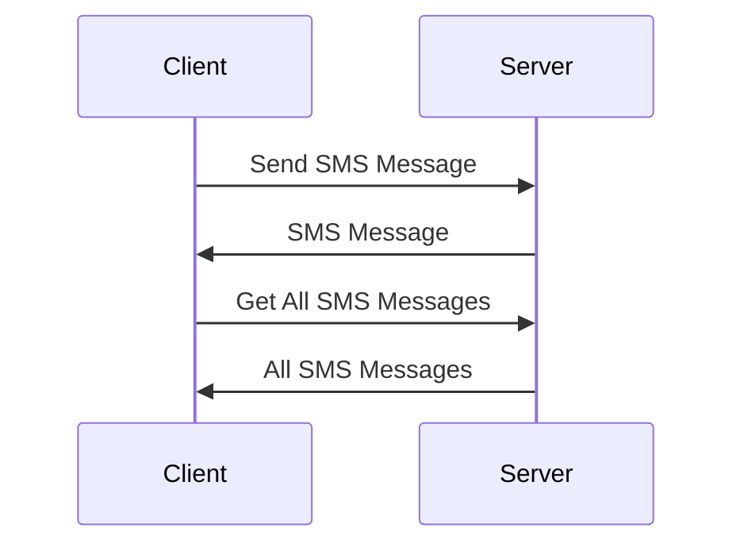
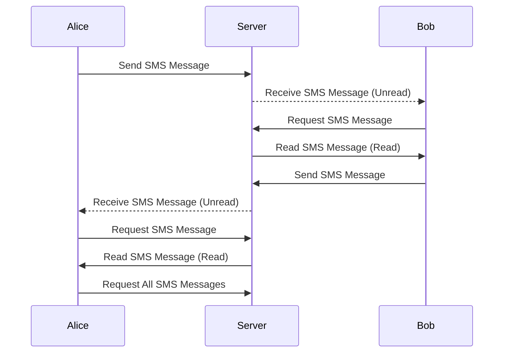

# PHP SMS Messages Queueing 

```
#Question

Brief:

Write a simple PHP Application that offers queueing of SMS Messages.

 

Requirements:

Application must be written in PHP (8.x preferably)
HTTP API to insert an SMS Message in the queue
HTTP API to consume an SMS Message from the queue and returns it in JSON format (FIFO)
HTTP API to get the total number of messages in the queue 
HTTP API to get all SMS messages in the queue in JSON format
Have everything running without any dependency on an external system (database, service, etc.)
Simple readme on how to use the application
 

Bonus but Not Compulsory:

Use of composer packages where convenient instead of building from scratch
Secure coding with correct amount of filters applied
Have the project working inside a Docker container (that builds and runs locally)
Use vanilla PHP (no framework)
Submit the exercise via a github link
 

What we are looking for:

Adherence to standard coding style (PSR-12)
Adherence to modern coding standards (OOP, SOLID, DRY)
Code that can be easily understood with just right amount of clear and concise comments
Use of proper API methods for each endpoint (GET, POST, etc)

```

## There are 2 Applications in this repository

|         | Description | Run on Local | Run on Docker |
|---------|-------------|--------------|---------------|
| Full-Stack Socket.io | This is a full-stack application that uses Socket.io to send SMS messages to the client. |```php start.php start```|```docker compose up -d```|
| API | This is a simple API application that uses a queue to send SMS messages to the client. |```php server.php```|```docker compose up -d```|


## Installation & Run on Local (Full-Stack Socket.io)

1. Clone the repository

```bash
git clone https://github.com/nrazam95/PHP-SMS-Messaging-Queue.git
```

2. Install dependencies

```bash
composer install
```

3. Run the application

```bash
php start.php start
```


## Installation & Run on Local (API)

1. Clone the repository

```bash
git clone https://github.com/nrazam95/PHP-SMS-Messaging-Queue.git
```

2. Install dependencies

```bash
composer install
```

3. Run the application

```bash
php -S localhost:8000 server.php
```

## Installation & Run on Docker (Full-Stack Socket.io && API)

1. Clone the repository

```bash
git clone https://github.com/nrazam95/PHP-SMS-Messaging-Queue.git
```

2. Run the application

```bash
docker compose up -d
```

## Prepare Your Environment

1. Create a .env file in the root directory of the project

```bash
cp .env.example .env
```


## Usage

1. Open your browser and go to http://{YOUR_HOST}:{YOUR_PORT}/


## Architecture

### Full-Stack Socket.io

1. The client connects to the server using Socket.io
2. The client sends a request to the server to send an SMS message
3. The server sends the SMS message to the client using Socket.io
4. The client receives the SMS message from the server using Socket.io
5. The client sends a request to the server to get all SMS messages
6. The server sends all SMS messages to the client using Socket.io
7. The client receives all SMS messages from the server using Socket.io




### API

1. The client sends a request to the server to send an SMS message
2. The server sends the SMS message to the client
3. The client sends a request to the server to get all SMS messages
4. The server sends all SMS messages to the client




# PHP SMS Messages Queueing Documentation

## API Endpoints

URL: http://{YOUR_HOST}:{YOUR_PORT}/

### Register (POST)

    + Request (application/json)

            {
                "name": "John Doe",
                "phone": "0123456789"
            }

    + Response 200 (application/json)

            {
                "status": "success",
                "message": "User has been registered successfully."
            }
            


